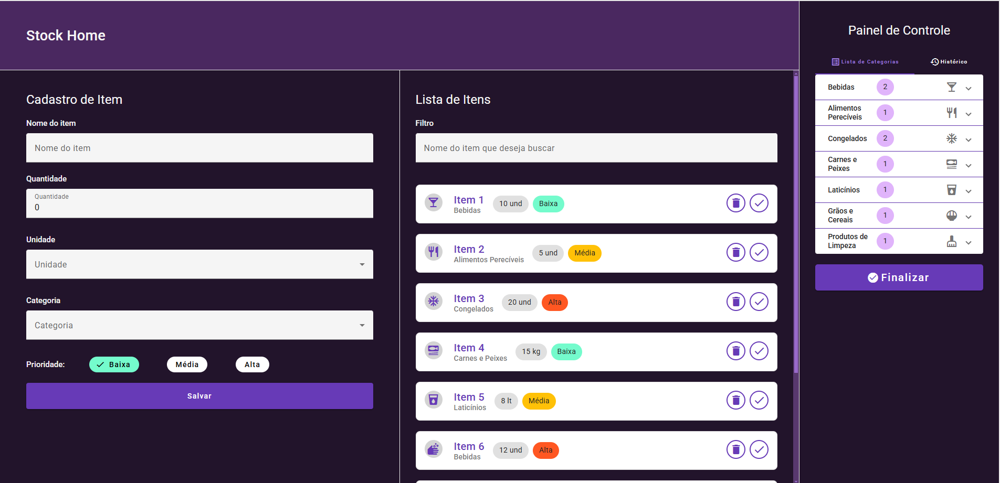
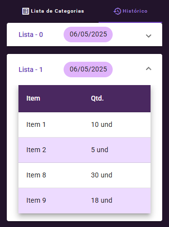

# 🏠 StockHome

**Versão: 0.1.0 — versão inicial**

**StockHome** é uma aplicação web desenvolvida com **Angular 19**, **TypeScript**, **Angular Material** e **IndexedDB** (via biblioteca `idb`) para facilitar a criação e o gerenciamento de listas de compras, mesmo em modo **offline**.

## 🧩 Tecnologias Utilizadas

- ✅ Angular 19
- ✅ TypeScript
- ✅ Angular Material
- ✅ IndexedDB (`idb`)

## 🎯 Funcionalidades

- Cadastro de itens com nome, categoria, quantidade e prioridade.
- Visualização em tempo real da lista atual de compras.
- Marcação de itens adquiridos com um simples clique.
- Finalização da lista com salvamento automático no histórico.
- Armazenamento local com **IndexedDB**, permitindo funcionamento **offline**.

## 🔗 Demonstração

Você pode testar a aplicação em funcionamento no GitHub Pages:

👉 [Acessar versão demonstrativa](https://luisfernandobs.github.io/stock-home/)

## 🖼️ Interface

A aplicação possui uma interface limpa e responsiva, utilizando os componentes do Angular Material para melhor experiência do usuário.

## 🖼️ Capturas de Tela

### 📋 Lista de Itens



### 📜 Histórico de Listas



## 💾 Armazenamento Offline

As listas finalizadas são salvas em um histórico local utilizando o `IndexedDB` com a biblioteca `idb`, permitindo ao usuário acessar dados antigos mesmo sem conexão com a internet.

## 🚀 Como Executar

1. **Clone o repositório**:

   ```bash
   git clone https://github.com/seu-usuario/stockhome.git
   cd stockhome

   ```

2. **Instale as dependências:**:

   ```
   npm install

   ```

3. **Execute a aplicação:**:

   ```
   npm start

   ```

## 📦 Versão

- **Atual:** 0.1.0 (versão inicial)
- Em desenvolvimento ativo — melhorias e novos recursos virão em breve.
